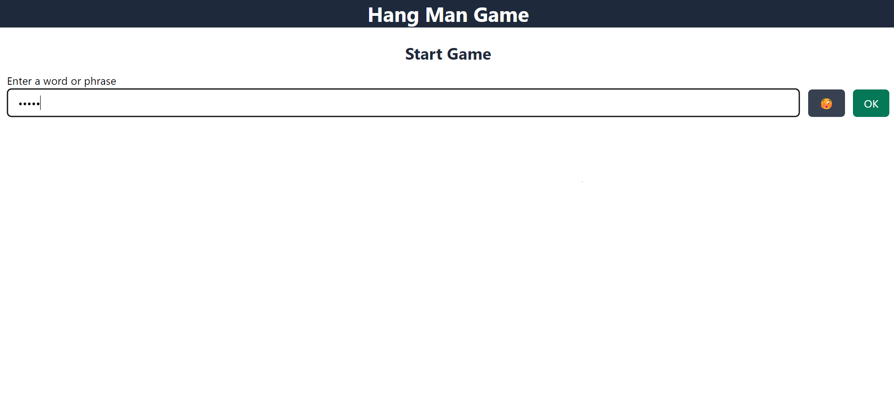
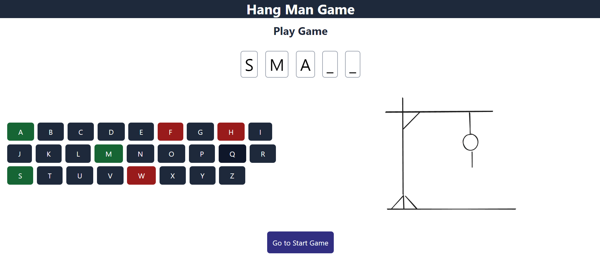
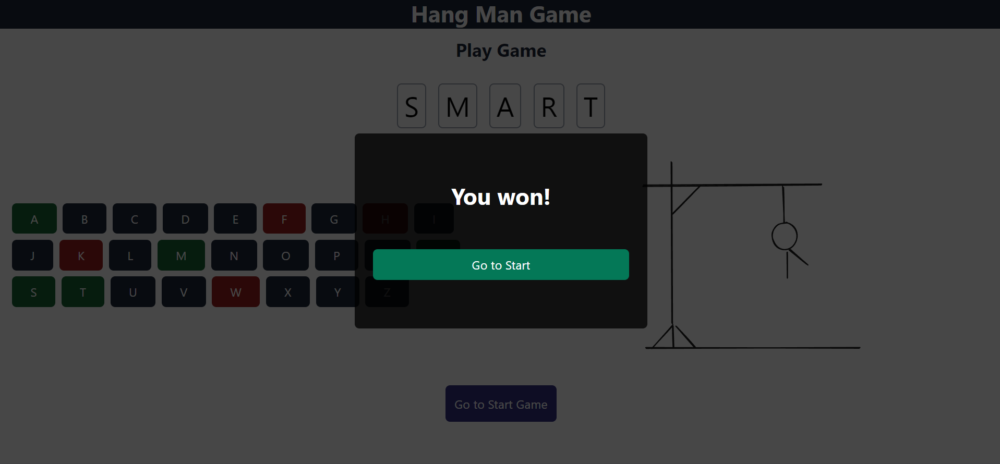
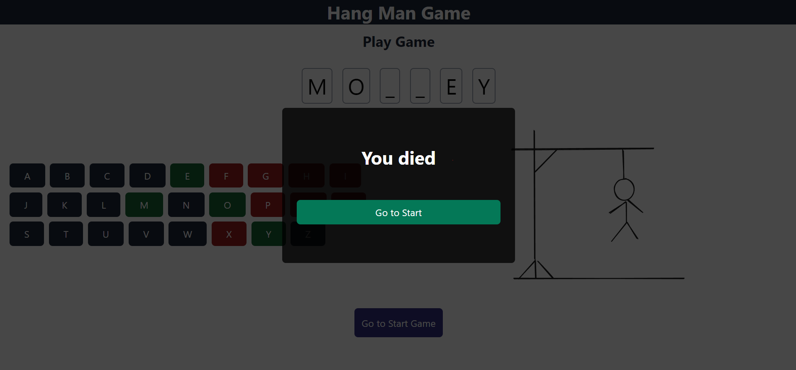

# Hangman Game

A classic Hangman game built using React, with multiple features like word submission, a virtual keyboard, and a dynamic hangman image. This game allows two players to interact: one enters a word, and the other tries to guess it.

## Features

- *React Router DOM Integration:* Seamless navigation between the start page and play page.
- *Word Submission:* One player can submit a word, which the other player will try to guess.
- *Virtual Keyboard:* Players can guess the word using an on-screen keyboard.
- *Hangman Image:* A hangman image appears progressively with each incorrect guess, leading to a loss after seven wrong attempts.
- *Win/Loss Logic:* Players win if they guess the word correctly within seven tries. If they fail, they lose and see the complete hangman.

## Preview

## Technologies Used

- React
- React Router DOM

## [Live Website]

## How to Play

1. Start the app, and you will be redirected to the start page.
2. Enter a word for the other player to guess and press "OK".
3. The game will redirect you to the play page, where the other player will try to guess the word using the virtual keyboard.
4. For each incorrect guess, part of the hangman will appear.
5. The game ends when the player either guesses the word correctly or makes seven incorrect guesses.
6. After the game ends, you can return to the start page and play again with a new word.

